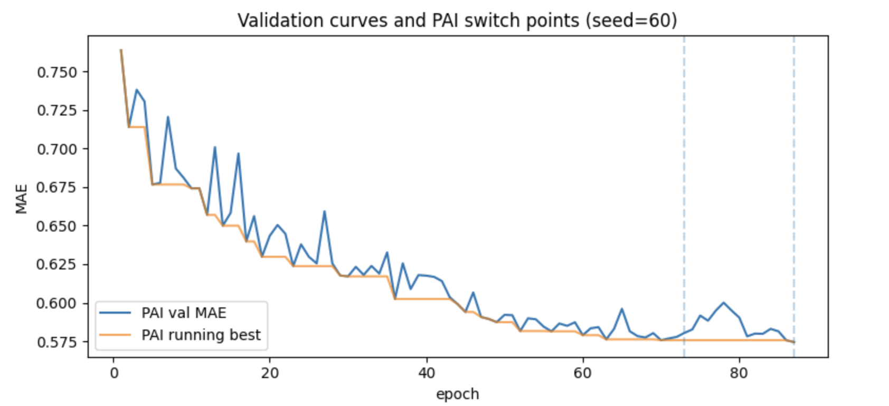
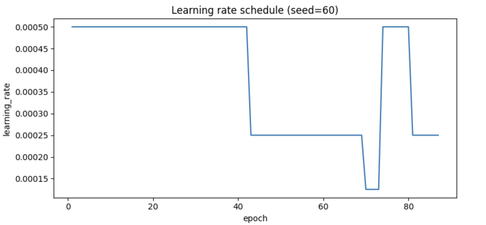

# Analysis of NNConv + PerforatedAI (PAI) on QM Dataset

## Table of Contents

- [1. Experiment Setup](#1-experiment-setup)
  - [1.1 Dataset and Task](#11-dataset-and-task)
  - [1.2 Model Architecture](#12-model-architecture)
- [2. Baseline vs PAI Summary](#2-baseline-vs-pai-summary)
- [3. Training Dynamics (seed = 60)](#3-training-dynamics-seed--60)
  - [3.1 Validation Curves and PAI Switch Points](#31-validation-curves-and-pai-switch-points)
  - [3.2 Learning Rate Schedule](#32-learning-rate-schedule)
  - [3.3 Epoch Time and Runtime Overhead](#33-epoch-time-and-runtime-overhead)
- [4. Cycle-Level Structural Analysis](#4-cyclelevel-structural-analysis)
  - [4.1 Parameter Counts per Cycle](#41-parameter-counts-per-cycle)
  - [4.2 Cycle-Level Performance](#42-cyclelevel-performance)
- [5. Discussion and Limitations](#5-discussion-and-limitations)

---

## 1. Experiment Setup

### 1.1 Dataset and Task
This project is based on the HW4: Graph Neural Networks assignment from 38-616/09-616 (Spring 2025)https://www.kaggle.com/competitions/s25-09616-hw4. The data come from the associated Kaggle competition, where the goal is to perform regression on molecular graphs: given a molecule, predict a single scalar target property.
Each molecule is represented as a graph and stored in PyTorch Geometric format:

Nodes correspond to atoms, with a fixed-dimensional feature vector per atom.

Edges correspond to bonds, with a feature vector per bond.

The experiment evaluates a graph neural network (GNN) based on `NNConv` and `Set2Set` on a QM-style molecular property prediction task.

- Source file: `train.pt`
- Number of graphs: `N = 20,000`
- Node feature dimension: `num_features = 11`
- Edge feature dimension: `edge_in = 4`
- Task: **regression** – predict a scalar target `y` per graph.
- Evaluation metrics:
  - Training: Mean Squared Error (MSE)
  - Validation/Test: Mean Absolute Error (MAE), plus MSE for logging

Dataset split (fixed once using `CFG.seed = 60`):

- Train: 16,000 graphs
- Validation: 2,000 graphs
- Held-out test: 2,000 graphs

### 1.2 Model Architecture

Both **Baseline** and **PAI** use exactly the same backbone:

- Input projection: `Linear(num_features → dim)`
- **3 × NNConvBlock**, each block:
  - `NNConv(dim → dim, edge_mlp(edge_in → dim*dim), aggr='mean')`
  - `GraphNorm(dim)`
  - `Dropout(p=0.1)`
  - Residual connection around the block
- Global pooling: `Set2Set(dim, processing_steps=3)`
- Prediction head:
  - `Linear(2*dim → dim) → ReLU → Dropout → Linear(dim → 1)`

Key hyperparameters:

```text
dim           = 64
n_layers      = 3
dropout       = 0.1
batch_size    = 128
max_epochs    = 200
lr            = 5e-4
weight_decay  = 0.0
grad_clip     = 2.0
scheduler     = ReduceLROnPlateau(mode='min', factor=0.5,
                                  patience=5, min_lr=1e-6)
early_stop    = 20 epochs without validation improvement
````

---

## 2. Baseline vs PAI Summary

The table below summarizes the main metrics for the **Baseline** and **PAI** models on the same train/val/test split (seed = 60).

| Model    | Best Val MAE | Test MAE (held-out) |
| -------- | ------------ | ------------------- |
| Baseline | **0.585139** | **0.644203**        |
| PAI      | **0.574468** | **0.632334**        |

Observations:

* PAI improves **validation MAE** by about `0.0107` (≈ **1.8 % relative**).
* PAI improves **test MAE** by about `0.0119` (also ≈ **1.8 % relative**).
* On this seed, PAI provides a consistent, small but clear gain in both validation and held-out test performance over the vanilla NNConv baseline.

PAI-specific configuration:

* `initialize_pai(doing_pai=True, save_name='PAI', making_graphs=False)`
* Switch mode: `DOING_HISTORY`
* Scheduled parameters (where available in the open-source build):

  * `n_epochs_to_switch = 10`
  * `p_epochs_to_switch = 10`
  * `history_lookback = 1`
  * Intended improvement threshold ≈ 0.003 for triggering structure changes

 * Reproduction note: using the returned `.py` script (seed = 60), I was able to reproduce a similar improvement, achieving **Test MAE -> Baseline: 0.621168 | PAI: 0.6011382.


---

## 3. Training Dynamics (seed = 60)

All plots in this section are generated from the CSVs in `outputs/PAI_seed60/`.
If you save them from the notebook, suggested filenames are:

* `plots/validation_curves_seed60.png`
* `plots/lr_schedule_seed60.png`
* `plots/epoch_time_seed60.png`

### 3.1 Validation Curves and PAI Switch Points



Data sources:

* `Scores.csv` (`epoch`, `val`, `running_val`, `test_at_valbest`)
* `switchEpochs.csv` (`epoch_switch_back_to_neuron`)

Key patterns:

In this run, the PAI validation MAE drops quickly from about 0.76 at the first epoch to roughly 0.64 by around epoch 20, and then continues to improve more slowly toward 0.58. The corresponding running-best curve is smooth and strictly decreasing, eventually stabilizing near 0.575–0.576 as training progresses. Vertical dashed lines in the plot indicate epochs where PAI switches back to the neuron mode; here we observe two such switches, around epoch 73 and epoch 88. The first switch happens roughly at the end of a long plateau in the validation curve, and immediately after this switch the validation MAE briefly gets worse before recovering and improving slightly beyond the previous level. Overall, the global best validation MAE reported by the training loop is 0.574468, which occurs near the end of training after the final switch.

Interpretation:

* PAI is conservative: it allows the base architecture to learn for tens of epochs before attempting structural changes.
### 3.2 Learning Rate Schedule



Data source:

* `LearningRate.csv` (`epoch`, `learning_rate`)

In this section we look at how the learning rate evolves over epochs using `LearningRate.csv`. From epochs 1–42 the LR stays at 5e-4; around epoch 43 `ReduceLROnPlateau` triggers the first decay to 2.5e-4 when validation performance plateaus. A second decay in the early 70s brings the LR down to 1.25e-4, again after a period of slow improvement.

After the first PAI switch (≈ epoch 73), the optimizer and scheduler are re-created, so the LR is reset to 5e-4 for the restructured model and later decays again to 2.5e-4 as the new validation curve flattens. Overall, LR drops align well with validation plateaus, and the combination of LR resets plus PAI switches effectively creates several distinct “training phases” within a single run.

### 3.3 Epoch Time and Runtime Overhead

Using `Times.csv` (`epoch`, `time_sec`), the per-epoch runtime fluctuates between roughly 6.8 s and 9.0 s, which is expected noise from data loading and GPU scheduling. On average, each epoch takes 7.776 s; before the first PAI switch (epoch < 73) the mean is 7.713 s, and after the switch it increases slightly to 8.079 s.

This implies that PAI’s structural updates introduce only a small runtime overhead: about 0.37 s per epoch, or roughly 4–5 % more than the pre-switch phase, with no catastrophic slowdown. Given that we gain around 1.8 % improvement in MAE for this run, the extra cost per epoch is modest and the accuracy–time trade-off is reasonable.

---

## 4. Cycle-Level Structural Analysis

PAI maintains the concept of **cycles**: each time it switches back to neuron mode with a potentially restructured architecture, a new cycle starts.

The following analysis uses:

* `paramCounts.csv` – parameter count at the start of each cycle.
* `best_test_scores.csv` –, for each cycle, `(param_count, best_val, test_at_best)`.

After merging these two files on `param_count`, we obtain a cycle-level table:

```text
cycle_id  param_count  best_val   test_at_best
0         880,578      0.575695   0.631096
1         889,796      0.575655   0.644147
```

### 4.1 Parameter Counts per Cycle

Suggested plot: `plots/cycle_param_counts_seed60.png`

* **Cycle 0:** `880,578` parameters
* **Cycle 1:** `889,796` parameters

The parameter count **increases slightly** (+9,218 parameters, ≈+1 %) in cycle 1.
This indicates that, in this run, PAI tends to **expand** the model a bit during restructuring rather than prune it.

### 4.2 Cycle-Level Performance

Suggested plot: `plots/cycle_best_scores_seed60.png`

* **Cycle 0:**

  * `best_val = 0.575695`
  * `test_at_best = 0.631096`
* **Cycle 1:**

  * `best_val = 0.575655` (slightly better validation)
  * `test_at_best = 0.644147` (worse test performance)

Additional summary (from the notebook):

* **Best Val MAE across cycles (cycle-level):** `0.575655`
* **Best cycle id:** `1`

Interpretation:

At the performance level, cycle 1 finds a marginally better validation optimum than cycle 0 (difference ≈ 4e-5), but its test MAE at that validation best is worse (0.644 vs 0.631). The global best test MAE (0.632334) reported by the training loop actually occurs at a later epoch inside the final cycle, not exactly at the cycle-level validation minimum stored in best_test_scores.csv. This mismatch between best_val and test_at_best highlights that PAI and our early-stopping logic are tuned to validation error, not test error, so mild overfitting to the validation set is possible. In practice, the final best test MAE is achieved in the last neuron phase, using a network whose architecture has already been modified by PAI (as indicated by the larger parameter count in cycle 1), so PAI effectively acts as an architecture-search phase whose resulting model is then trained and evaluated in standard neuron mode.

---

## 5. Discussion and Limitations

On this seed=60 run, PAI improves both validation and test MAE by about **1.8 %** over a strong NNConv baseline.The improvement is modest but consistent and obtained without changing the base architecture or loss function.PAI’s structural changes are small (≈1 % more parameters) but enough to slightly push the model to a better optimum.
The per-epoch runtime after the first switch is only ≈5 % slower, and there are only a couple of switches.For this experiment, PAI behaves like a lightweight architecture search mechanism, rather than an expensive meta-learning loop.
Cycle-level results show that the cycle with the best validation MAE does not have the best test MAE.This highlights a potential risk of overfitting to validation when the same split is used for both hyperparameter tuning and architecture selection.
I also ran the same model with a different random seed and a smaller 1k validation split, and in that setting PAI exhibited much stronger overfitting (validation MAE kept improving while test MAE degraded), reinforcing that PAI has a noticeable tendency to overfit the validation set when it is small.

**Limitations**

* All conclusions are based on a single random seed and a single dataset.
* Did not run a systematic multi-seed study (e.g., 5 seeds) to estimate variance in PAI’s gains.
* Alternative backbones (GIN, GAT, deeper NNConv, etc.) were not explored.

**Future work**

* Run Baseline and PAI over multiple seeds and report mean ± std of MAE.
* Tune PAI switch hyperparameters more carefully and study their impact.
* Compare against other regularization and architecture-search baselines (e.g., dropout schedules, width/depth changes, Neural Architecture Search).
* Evaluate PAI on additional graph benchmarks to test robustness.

---
```
